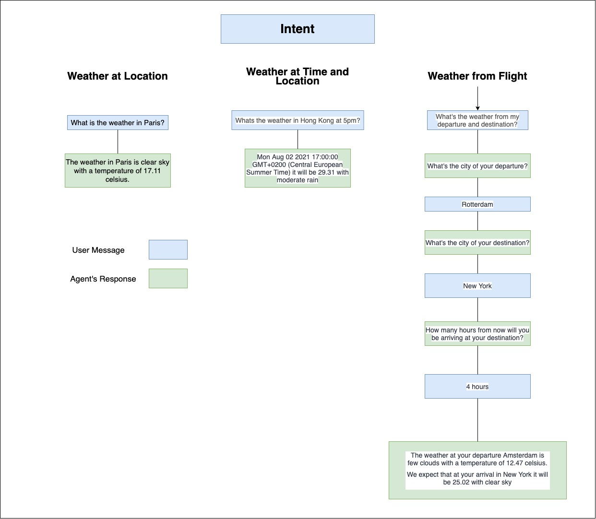

# Ciphix' Conversational Automation Air Case

## Documentation

The Ciphix Air Virtual Assistant is able to handle different inputs the users give the bot. The Virtual Assistant is also supported in Telegram via this link: https://t.me/CiphixAirBot

The agent expects the user to ask a question and based on the question a response will be given. To get the weather, the virtual agent expects a city to be given in the message and retrieves the weather based on the city. Time should be specified in hours. The first next date of the given time will be the time that is used to retrieve the weather from. To obtain a flight's departure and destination weather, both will be asked to the pilot and the amount of hours before the airplane arrives at its destination.

## Features

- Obtain the weather conditions for a specific city
- Obtain the weather conditions for a city with a specified time
- Obtain flight's departure and destination weather

## Encountered problems

Problems that were encoutered were:
- Retrieving the weather for a specific time. If a user wants to retrieve the weather for a time in future after the current or following day, the virtual assistant will not be able get gather that data. But for this case, it would seem unnecessary since flights are never over a day long.
- Retrieving weather from the departure as well as the destination. This was solved by asking the destination and departure location to know from where we should gather the weather data from.
- Wanted to implement a custom made front-end but retrieving the data from the dialogflow API wasn't figured out yet.

## Diagram

